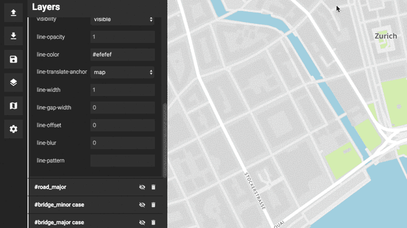
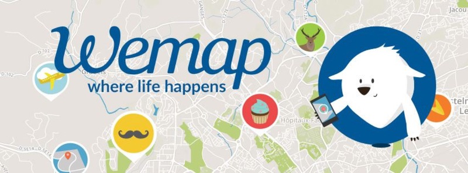
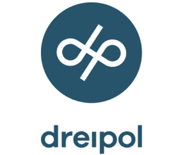

# Maputnik  

A free and open visual editor for the [Mapbox GL styles](https://www.mapbox.com/mapbox-gl-style-spec/)
targeted at developers and map designers. Creating your own custom map is easy with **Maputnik**.

[**Please support this project on Kickstarter**](https://www.kickstarter.com/projects/174808720/maputnik-visual-map-editor-for-mapbox-gl).

[](https://www.kickstarter.com/projects/174808720/maputnik-visual-map-editor-for-mapbox-gl)

## Reasons for building a Mapbox GL Style Editor

Mapbox GL is one of the biggest innovations the GIS world and is the first cross platform framework to display maps on the [browser](https://github.com/mapbox/mapbox-gl-js), [mobile applications and the desktop](https://github.com/mapbox/mapbox-gl-native). Maps are styled using a JSON style document with properties described in the [Mapbox GL style specification](https://www.mapbox.com/mapbox-gl-style-spec/). The style specification is adopted in more and more clients such as Open Layers 3 and therefore the **missing piece in the puzzle is a style editor that is easy to use, free and open source!**

In constrast to earlier approaches using [CartoCSS](https://www.mapbox.com/help/getting-started-cartocss/) the format is difficult to edit by hand but much more suitable for generating from an editor.
As of today Mapbox GL styles are usually designed within the cloud based [Mapbox Studio](https://www.mapbox.com/mapbox-studio/)
which is a great example how a style editor should look like.

The big problem is that Mapbox Studio is not open source and you have to upload your data sources to external servers and
essentially are locked in the Mapbox ecosystem. By reusing existing proprietary base styles you legally tie your style for use with Mapbox services. It is difficult to use other data source like [OSM2VectorTiles](http://osm2vectortiles.org), [Mapzen](https://mapzen.com/projects/vector-tiles/) or [Kartotherian](https://github.com/kartotherian/kartotherian) or even your own custom vector tile sources.

This is why I think we should rally behind and build our own style editor for the Mapbox GL style specification!
[Help me get the funding together](https://www.kickstarter.com/projects/174808720/maputnik-visual-map-editor-for-mapbox-gl) to take time of work and make this happen!

## Features

- [x] Completely free and open source
- [x] Visual interface for designing maps
- [x] Immediate feedback (thanks to [style diffs](https://github.com/mapbox/mapbox-gl-style-spec/blob/mb-pages/lib/diff.js))
- [x] Edit layers
- [x] No vendor lock-in, no proprietary base styles
- [x] Easy to deploy as single HTML file



**Roadmap**

- [ ] Layer editing history (it is a mess right now)
- [ ] Add new layers
- [ ] Support all layer types
- [ ] Choose sources
- [ ] Filter data from sources
- [ ] Support zoom level specific values
- [ ] Faster map feedback with custom diff algorithm
- [ ] Tests for React components
- [ ] Make it prettier

## Develop

Maputnik is written in ES6 and is using [React](https://github.com/facebook/react), [Immutable.js](https://facebook.github.io/immutable-js/) and [Mapbox GL JS](https://www.mapbox.com/mapbox-gl-js/api/).

Install the deps, start the dev server and open the web browser on `http://localhost:8888/`.

```bash
# install dependencies
npm install
# start dev server
npm start
```

Build a production package for distribution.

```
npm run build
```

Lint the JavaScript code.

```
# install lint dependencies
npm install --save-dev eslint eslint-plugin-react
# run linter
npm run lint
```

## Sponsors

This project would not be possible without commercial and individual sponsors.

### Gold

[](https://getwemap.com/)

[](http://terranodo.io/)

### Silver

<a href="https://www.klokantech.com/">
  
</a>
<a href="https://www.dreipol.ch/">
  
</a>
<br/>

### Individuals

**Influential Stakeholder**

- Alan McConchie
- Odi
- Mats Norén
- Uli [geOps](http://geops.ch/)
- Helge Fahrnberger
 Kirusanth Poopalasingam

**Stakeholder**

- Brian Flood
- Vasile Coțovanu
- Andreas Kalkbrenner
- Christian Mäder
- Gregor Wassmann
- Lee Armstrong
- Rafel
- Jon Burgess
- Lukas Lehmann
- Joachim Ungar
- Alois Ackermann
- Zsolt Ero
- Jordan Meek

**Supporter**

- Sina Martinelli
- Nicholas Doiron
- Neil Cawse
- Urs42
- Benedikt Groß
- Manuel Roth
- Janko Mihelić
- Moritz Stefaner
- Sebastian Ahoi
- Juerg Uhlmann
- Tom Wider
- Nadia Panchaud
- Oliver Snowden
- Stephan Heuel
- Tobin Bradley
- Adrian Herzog
- Antti Lehto
- Pascal Mages
- Marc Gehling
- Imre Samu
- Lauri K.
- Visahavel Parthasarathy
- Christophe Waterlot-Buisine
- Max Galka
- ubahnverleih
- Wouter van Dam
- Jakob Lobensteiner
- Samuel Kurath
- Brian Bancroft

## License

Maputnik is [licensed under MIT](LICENSE) and is Copyright (c) Lukas Martinelli and contributors.

**Disclaimer** This project is not affiliated with Mapbox or Mapbox Studio. It is a free independent style editor for the
open source technology in the Mapbox GL ecosystem.
As contributor please take extra care of not violating any Mapbox trademarks. Do not get inspired by Mapbox Studio and make your own decisions for a good style editor in order to avoid future [copyright problems like in OSM2VectorTiles](https://github.com/osm2vectortiles/osm2vectortiles/issues/387).
